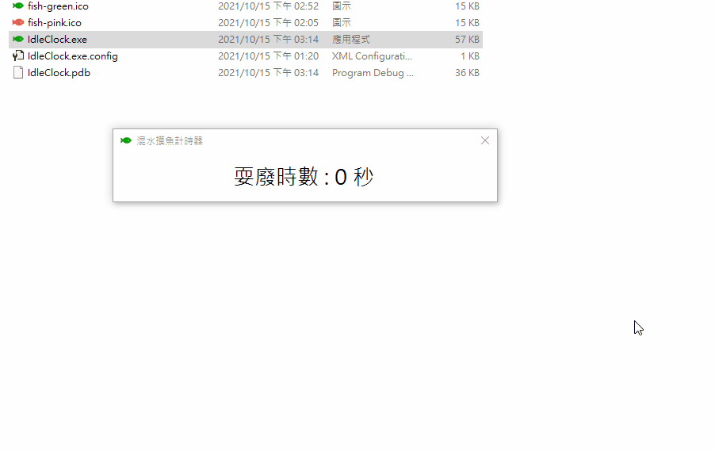
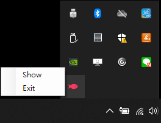

# IdleClock
計算員工混水摸魚的時間 , 慣老闆神器
覺得自家員工總是常常不在位置上鬼混嗎?安裝他就對了! 保證鬼混時間盡收眼底!

每隔 30 秒的閒置便會開始累加鬼混時間 , 除非鍵盤或滑鼠有操作才會解除 , 但是時間是一直往上累加的 , 所以可以用來追查一些上班都在拉屎之類的人 ~

往好處用可以追查自己每天浪費的時間 , 並且修正自己 , 難得講這麼正面的幹話

可以像是 Line or Skype 龜縮到右下角 , 計時時間持續計算

